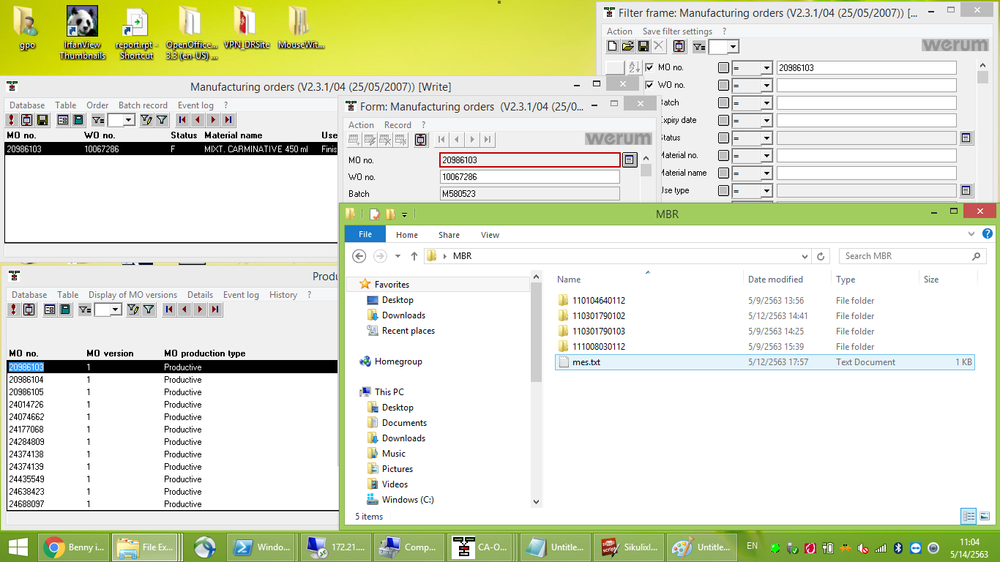
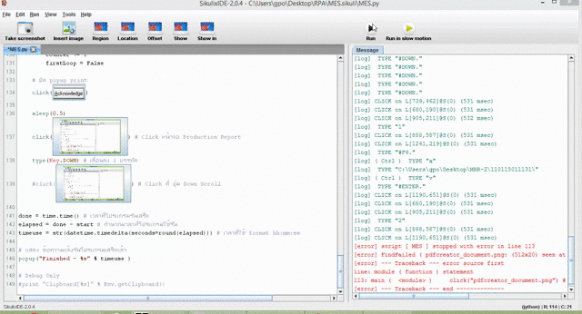

# MES_RPA

RPA เพื่อ Export PDF จากโปรแกรม MES ด้วย SikuliX

# Tech

- SikuliX
- Jython (Java + Python)

# Information

- ใช้โปรแกรม SikuliX + Jython ในการรัน
  - Download SikuliX http://sikulix.com/
  - Setup jython https://github.com/RaiMan/SikuliX1/wiki/How-to-make-Jython-ready-in-the-IDE
- PDFCreator 1.2.3
- เครื่องต้องมี jre เวอร์ชั่น 8 ขึ้นไป
- หน้าจอความละเอียด 1366 x 768

# Template (1366 x 768)

- 

# Example (1366 x 768)

- 
